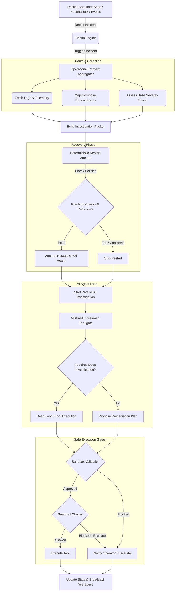

# ⚓ DockHeal

DockHeal is a high-performance **Autonomous Healing and AI-Assisted Incident Investigation Platform** for Docker environments. It combines deterministic recovery rules, detailed telemetry aggregation, and an agentic AI loop (powered by Mistral models) to diagnose, explain, and safely remediate container failures in real-time.

---

## 🏗️ Architecture & Lifecycle

Below is the lifecycle of an incident in DockHeal—from detection to remediation, sandboxing, and escalation:



---

## 📁 Repository Structure

The workspace is organized into two main projects: a Python backend and a React/Vite client.

```
DockHeal/
├── backend/                  # FastAPI Application
│   ├── app/
│   │   ├── ai/               # AI Investigator, Guardrails, Sandbox, and Tools
│   │   │   ├── tools/        # MCP Tools (fetch_logs, restart_container, etc.)
│   │   │   ├── deep_investigator.py  # Iterative Deep Investigation Loop
│   │   │   ├── guardrails.py         # Multi-layered hard & soft safety policies
│   │   │   ├── investigator.py       # Main Mistral streaming execution engine
│   │   │   ├── output_parser.py      # Structuring AI outputs
│   │   │   └── sandbox.py            # Local command sandbox validation
│   │   ├── containers/       # Placeholder for future container logic
│   │   ├── context/          # Operational Context Aggregation Layer
│   │   │   ├── aggregator.py         # Aggregates logs, metrics, events, and deps
│   │   │   ├── dependency_mapper.py  # Maps Docker-compose sibling states
│   │   │   ├── log_collector.py      # Parses logs for errors, crash signals
│   │   │   └── event_collector.py    # Tracks frequent exit patterns / die counts
│   │   ├── docker_monitor/   # Continuous monitoring and background loops
│   │   │   ├── container.py          # Docker client wrappers
│   │   │   ├── events.py             # Docker Event listener
│   │   │   ├── metrics.py            # Real-time resource utilization (CPU, Mem)
│   │   │   └── monitor_loop.py       # 30-second periodic health evaluator
│   │   ├── runtime/          # Mutability registries and state variables
│   │   │   ├── policy_registry.py    # Live, mutable configuration rules
│   │   │   └── state.py              # In-memory incident tracking and audit logs
│   │   ├── services/         # Remediation and Recovery logic
│   │   │   ├── health_engine.py      # Incident detection logic
│   │   │   ├── recovery.py           # Deterministic recovery execution (polling)
│   │   │   └── remediation.py        # Remediation interface helper
│   │   ├── web_sockets/      # WebSocket manager for client updates
│   │   └── main.py           # Entry point and FastAPI routes definition
│   └── requirements.txt      # Python dependencies
└── client/                   # Vite / React Frontend
    ├── src/
    │   ├── components/       # Shadcn UI wrappers
    │   ├── pages/            # View Templates (Dashboard, Policies, etc.)
    │   ├── store.js          # Zustand store with integrated WS handlers
    │   └── main.jsx          # Frontend initialization
    └── package.json          # Node dependencies
```

---

## ⚙️ Configuration & Live Policies

DockHeal manages its runtime constraints via `PolicyRegistry` inside [policy_registry.py](file:///c:/Users/Aditi%20Sable/DockHeal/backend/app/runtime/policy_registry.py). Policies can be customized at launch using environment variables prefixed with `DOCKHEAL_` or changed dynamically via API calls.

### Core Policy Parameters

| Environment Variable | Default Value | Description |
| :--- | :--- | :--- |
| `DOCKHEAL_COOLDOWN_SECONDS` | `300` | The minimum cooling-off period (in seconds) between two remediation attempts on the same container. |
| `DOCKHEAL_MAX_RETRIES` | `3` | Maximum remediation retry attempts allowed before escalating an incident to human operators. |
| `DOCKHEAL_SEVERITY_GATE` | `80` | Severity score threshold (0-100) above which any autonomous remediation requires manual operator approval. |
| `DOCKHEAL_OOM_BLOCK_RESTART` | `true` | If true, blocks autonomous restarts when an Out-Of-Memory (OOM) event is detected. |
| `DOCKHEAL_MAX_DEEP_ITERATIONS`| `5` | Maximum iterations (tool calls) allowed in the deep investigation loop before yielding. |
| `DOCKHEAL_RECOVERY_TIMEOUT_SECS`| `30`| Time to poll a restarted container before declaring health verification failed. |

> [!IMPORTANT]
> **Deterministic Severity Floors:** To prevent AI hallucinations from downplaying critical incidents, DockHeal floors incident severity scores based on deterministic heuristics:
> * **OOM Killed:** Minimum severity is forced to **`85`** (always triggers escalation).
> * **Crash Loop (Frequent Dies):** Minimum severity is forced to **`75`**.
> * **High Restart Counts:** Minimum severity is forced to **`60`**.

---

## 🛡️ Safety Safeguards & Guardrails

DockHeal runs a strict multi-layer security check before invoking any remediation tools proposed by the AI Agent:

1. **Phase Lockout**: Tools marked as Phase 2 (e.g., updating memory limits or rolling back images) are registered but hard-blocked by guardrails.
2. **Operator Locks**: Containers marked as operator-locked (via UI/API) block all autonomous actions.
3. **Manual Stop Protection**: Containers stopped manually by operators will never be restarted by DockHeal.
4. **Stale Packet Check**: If an investigation packet is older than `packet_max_age_secs` (default 60s), high-risk actions are blocked until the context is rebuilt.
5. **Cascading Failure Protection**: If 3 or more compose sibling containers are unhealthy, DockHeal escalates immediately to prevent cascade storms.

---

## 🔌 API Reference

The backend runs a REST API on port `8000` along with a WebSocket endpoint `/ws` for pushing real-time dashboard notifications.

### API Endpoints

* **`GET /`**: API metadata & root status check.
* **`GET /containers`**: Returns a list of all containers tracked by DockHeal.
* **`GET /incidents`**: Lists currently active incidents.
* **`POST /restart/{container_name}`**: Triggers a manual restart of a container.
* **`GET /containers/metrics`**: Fetches CPU, Memory, and Uptime metrics for all containers.
* **`GET /context/{container_name}`**: Fetches the structured telemetry aggregation packet.
* **`POST /context/{container_name}/build`**: Force rebuilds the telemetry context packet.
* **`POST /investigate/{container_name}`**: Manually triggers the AI Investigator pipeline.
* **`GET /investigate/{container_name}/stream`**: Server-Sent Events (SSE) endpoint to stream AI thoughts in real-time.
* **`POST /lock/{container_name}`**: Blocks all autonomous healing actions for this container.
* **`POST /unlock/{container_name}`**: Re-enables autonomous healing actions.
* **`GET /policies`**: Retrieves current runtime policy configurations.
* **`GET /audit`**: Lists log entries containing all actions (attempted and executed) with durations.

---

## 🖥️ Client Pages

The React client utilizes Tailwind CSS v4.0 for utility-first responsive layout styling and Zustand for store management. The UI contains five primary views:

1. **📊 Dashboard**: Real-time listing of active containers, CPU/Memory gauges, list of active incident tickets, and manual actions (Restart, Lock/Unlock).
2. **🧠 Investigations**: Interactive terminal showing streaming Mistral thoughts, deep loop tool queries, sandbox approvals, and final root-cause analysis (RCA) assessments.
3. **📜 Policies**: Live toggles and sliders displaying runtime policy thresholds (e.g. cooldown periods, retry limits, memory overrides).
4. **🧪 Sandbox**: Incident injector Bed allowing engineers to simulate container failures (memory leaks, crash loops, healthcheck timeouts) to verify healing routines.
5. **⏳ Timeline**: Reverse-chronological audit logs detailing remediation outcomes, tool execution times, and block histories.

---

## 🚀 Getting Started

### Prerequisites
* **Docker** running on your local machine.
* **Python 3.10+** (for backend).
* **Node.js 18+** (for client).
* **Mistral API Key** (set as `API_KEY` in environment variables for AI investigation capabilities).

### 1. Run the Backend
Navigate to the `backend` directory, set up your environment, and start the FastAPI service:
```bash
cd backend
python -m venv .venv
# On Windows PowerShell:
.venv\Scripts\Activate.ps1
# On Linux/macOS:
source .venv/bin/activate

pip install -r requirements.txt

# Create .env and set API_KEY=<your-mistral-api-key>
# Then run:
python -m uvicorn app.main:app --reload
```

### 2. Run the Client
Navigate to the `client` directory, install packages, and start the development server:
```bash
cd client
npm install
npm run dev
```

---

## 🛠️ MCP Tools Implementation

DockHeal contains custom tool wrappers mapped using the `@mcp_tool` decorator. These tools are secure, whitelist parameters, and log all events to the audit trail:

* **`inspect_container`** *(Safe / Read-only)*: Retrieves container configuration parameters, exit codes, and health.
* **`fetch_logs`** *(Safe / Read-only)*: Tail container logs (bounded at a max of 200 lines to prevent memory overflow).
* **`send_alert`** *(Safe / Escalation)*: Writes warning notifications and broadcasts them via WebSockets.
* **`restart_container`** *(Low Risk / Write)*: Safely restarts the target container.
